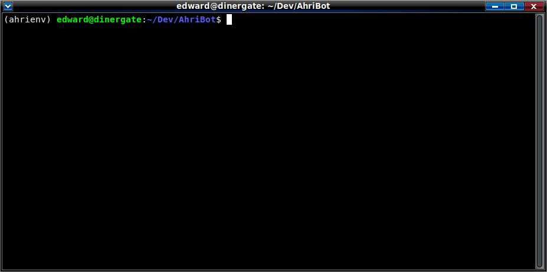
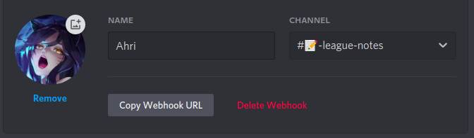

# Ahri



Ahri is a web-scraping bot written in Python for sharing *League of Legends* updates via Discord. When the bot is run, it will scrape the *League of Legends* Patch Notes webpage for new entries at a given interval, and will post to a Discord channel of the user's choosing whenever new updates have been made:


# Setup
## Dependencies
It is recommended that you first create a virtual environment in order to keep dependencies that are installed within the scope of the project's folder and not your entire system:
```
sudo apt-get install python3-venv

python3 -m venv [ENVIRONMENT_NAME]
source [ENVIRONMENT_NAME]/bin/activate
```
All dependencies required are held in ```requirements.txt``` and can be installed from there:
```
pip install -r requirements.txt
```
Ensure that you also have the required Environment Variables declared before running the bot (see **Environment Variables**).

---

## Environment Variables
A small number of variables/values can be set which adjust how the bot functions. Some of these variables are required in order for the bot script to work at all, and will not start without them being defined first.

Environment Variables <u>MUST</u> be declared in a nameless **.env** file, which should be created within the same folder/directory as ```ahri.py```.
```
touch .env
```

### Required Variables
The following variable(s) <u>MUST</u> be defined:
#### WEBHOOK_URL
```
WEBHOOK_URL = https://discord.com/api/webhooks/XXXXXXXXXXXXXXXX
```
The bot posts messages to Discord by making a POST Request to a Webhook URL provided by Discord, which must be created for the server that the bot will be posting to. 

This can be done by going to **Server Settings -> Integrations -> Webhooks**.



Note as well that the bot's profile picture, nickname and the channel it will be posting too are all specified here. Changing any of these later on should not affect the webhook URL.

When a webhook has been set up, simply copy and paste its URL as the variable.

### Optional
The following variables are not required, but may be desired in order to customize bot behaviour and what it posts:
### SUBSCRIBER_ROLE
```
SUBSCRIBER_ROLE = 000000000000000000
```
A server's Role ID can be specified in order to notify users with it assigned to them whenever the bot posts a new set of patch notes. 

In order to copy a Role's ID to be pasted in, Developer Mode must be enabled (**User Settings -> Advanced -> Developer Mode**).


If a role has not been specified, any tags to mention a particular role within a message will be automatically removed before being posted. You do not need to remove it yourself.

### UPDATE_MESSAGE
```
UPDATE_MESSAGE = "{AT_SUBSCRIBERS}
**{TITLE}** are now available:

{LINK}"
```


A custom message can be specified for the bot to post when new patch notes are discovered. If one is not specified, a default one is used instead.

If you would like to include information about the patch notes being posted, such as its title or URL, the following tags can be used in the message, which will be replaced with the following before being posted:

TAG | DESCRIPTION
---   | ----
{TITLE}          | The title of the patch notes being posted, as specified in its webpage.
{AT_SUBSCRIBERS} | Mention the subscriber role if one exists. (See *SUBSCRIBER_ROLE*).
{LINK}           | The URL to the patch notes being posted.

### QUERY_RATE
```
QUERY_RATE = 1800
```
How much time to wait in seconds before checking for new patch notes again. If this is not specified, 600 seconds (or 10 minutes) is used by default.

It is reccomended to set this value to be longer than the default amount and not to go below it, given the rate in which new patch notes are actually released, and in order to avoid potential rate limiting problems with the League of Legends website.
